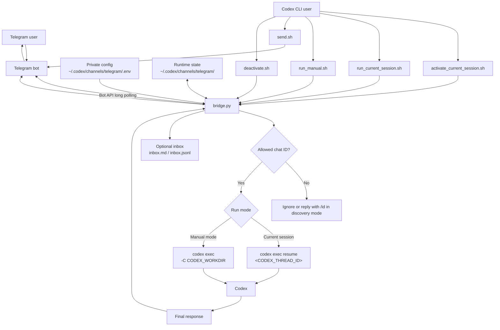

# Codex Telegram Bridge

Small local bridge for sending Telegram Bot messages to `codex exec`.

It uses Telegram long polling, so it does not open a public port and does not need a webhook. The bot token lives in a private local `.env` file under `~/.codex/channels/telegram/`, not in this repository.

## Security Model

- Use a dedicated Telegram bot token. Do not reuse another assistant's bot token.
- This bridge does not read or write `~/.claude`, Claude Code plugins, or Claude Code Telegram channel files.
- Only allow specific Telegram chat IDs with `TELEGRAM_ALLOWED_CHAT_IDS`.
- Incoming Telegram messages bind to the current Codex thread only when started with a current-session script such as `./scripts/activate_current_session.sh` or `./scripts/run_current_session.sh`.
- The bridge never uses `codex exec resume --last`; it uses the explicit `CODEX_THREAD_ID` from the current Codex CLI session.
- The bridge runs `codex exec` with `--sandbox workspace-write`.
- Attachments are ignored for now.
- Telegram bot chats are not end-to-end encrypted. Do not send passwords, API keys, private keys, or signing secrets through Telegram.
- Keep `CODEX_WORKDIR` narrow. The bridge defaults to the directory it is launched from if `CODEX_WORKDIR` is not set.

## Technical Architecture



The bridge is a local Telegram Bot API client. Telegram never connects inbound to your machine; the bridge repeatedly calls `getUpdates`, receives allowed messages, invokes Codex, and sends the final response back with `sendMessage`.

In current-session mode, the bridge does not guess which Codex session to use. It requires `CODEX_THREAD_ID` from the active Codex CLI session and calls `codex exec resume <CODEX_THREAD_ID>`. Manual mode skips session binding and creates a fresh `codex exec` run for each Telegram message.

## Install

Clone the repo somewhere local, then create a private config directory:

```bash
git clone git@github.com:<owner>/codex-telegram-bridge.git
cd codex-telegram-bridge
mkdir -p ~/.codex/channels/telegram
cp .env.example ~/.codex/channels/telegram/.env
chmod 600 ~/.codex/channels/telegram/.env
```

Optional Codex integrations:

```bash
mkdir -p ~/.codex/skills ~/.codex/prompts
cp -R skills/telegram-bridge ~/.codex/skills/
cp prompts/telegram.md ~/.codex/prompts/telegram.md
```

Restart Codex CLI after installing the skill or prompt.

## Private Config

Edit `~/.codex/channels/telegram/.env`:

```bash
TELEGRAM_BOT_TOKEN=your_bot_token
TELEGRAM_ALLOWED_CHAT_IDS=
CODEX_WORKDIR=/absolute/path/to/your/workspace
CODEX_BIN=codex
CODEX_SANDBOX=workspace-write
CODEX_TIMEOUT_SECONDS=1200
TELEGRAM_REQUIRE_CODEX_PREFIX=0
TELEGRAM_INBOX_ENABLED=1
```

To create the bot token:

1. Open Telegram and message `@BotFather`.
2. Run `/newbot`, choose a display name and a username ending in `bot`.
3. Copy the token into `TELEGRAM_BOT_TOKEN`.

To find your numeric chat ID:

1. Leave `TELEGRAM_ALLOWED_CHAT_IDS` empty.
2. Start the bridge.
3. Send `/id` to your bot.
4. Copy the returned numeric ID into `TELEGRAM_ALLOWED_CHAT_IDS`.
5. Restart the bridge.

When `TELEGRAM_ALLOWED_CHAT_IDS` is empty, the bridge is in discovery mode. It will reply to `/id` or `/start` with the chat ID, but it will not run Codex.

## Ways to Use

### Current Session, Background

```bash
./scripts/activate_current_session.sh
```

Use this from inside a Codex CLI session. It binds Telegram to that session's explicit `CODEX_THREAD_ID`, starts a user-level background long-polling process, and leaves the Codex CLI usable.

This is the closest practical equivalent to a Claude Code-style channel bridge for Codex. It does not install a service, does not use LaunchAgent, and does not open a port. Stop it with `./scripts/deactivate.sh` or `/stop` from Telegram.

This requires `CODEX_THREAD_ID` to be present. If the script is launched from an ordinary terminal, it exits instead of accidentally using an arbitrary session. Activation checks Telegram Bot API access before starting; if Codex sandboxing blocks network access, rerun the same command with scoped network approval.

### Current Session, Foreground

```bash
./scripts/run_current_session.sh
```

Use this when you want the bridge to stay strictly inside the current shell command. It also binds to `CODEX_THREAD_ID`, but it occupies the terminal until you press `Ctrl-C` or send `/stop`.

### Manual Mode, New Codex Exec Per Message

```bash
./scripts/run_manual.sh
```

Use this from any terminal if you do not want to bind to an existing Codex session. Each Telegram message creates a fresh `codex exec` run in `CODEX_WORKDIR`.

### Check Status

```bash
./scripts/status.sh
```

### Stop

```bash
./scripts/deactivate.sh
```

You can also stop the running bridge from Telegram:

```text
/stop
```

## Send from Codex CLI

From the same Codex CLI session, send a Telegram message without starting another listener:

```bash
./scripts/send.sh "message from Codex"
```

## Codex Skill and Prompt

If you installed the skill, trigger it in Codex CLI with:

```text
$telegram-bridge
```

If you installed the prompt, trigger it with:

```text
/prompts:telegram
/prompts:telegram status
/prompts:telegram stop
/prompts:telegram send message from Codex
```

## Inbox

If `TELEGRAM_INBOX_ENABLED=1`, inbound Telegram messages and outbound Codex replies are written to private local files:

```text
~/.codex/channels/telegram/inbox.md
~/.codex/channels/telegram/inbox.jsonl
```

These files are local state. Do not commit them.

## Slash Command Limitation

Codex CLI does not currently support arbitrary bare custom slash commands such as `/telegram`. It supports custom prompts as `/prompts:name`, so this repo includes:

```text
/prompts:telegram
/prompts:telegram status
/prompts:telegram stop
/prompts:telegram send message from Codex
```
