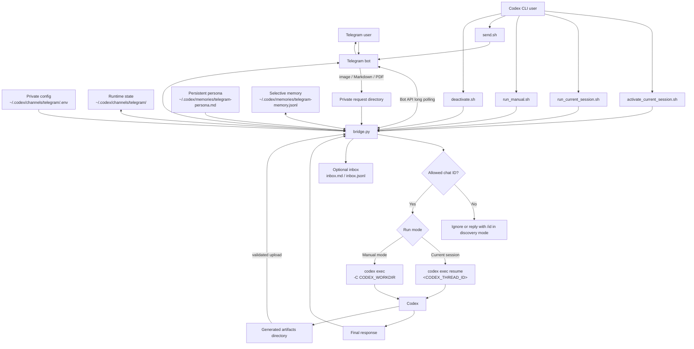

# Codex Telegram Bridge

Small local bridge for sending Telegram Bot messages to `codex exec`.

It uses Telegram long polling, so it does not open a public port and does not need a webhook. The bot token lives in a private local `.env` file under `~/.codex/channels/telegram/`, not in this repository.

## Security Model

- Use a dedicated Telegram bot token. Do not reuse another assistant's bot token.
- This bridge does not read or write `~/.claude`, Claude Code plugins, or Claude Code Telegram channel files.
- Only allow specific Telegram chat IDs with `TELEGRAM_ALLOWED_CHAT_IDS`.
- Incoming Telegram messages bind to the current Codex thread only when started with a current-session script such as `./scripts/activate_current_session.sh` or `./scripts/run_current_session.sh`.
- The bridge never uses `codex exec resume --last`; it uses the explicit `CODEX_THREAD_ID` from the current Codex CLI session.
- The bridge runs `codex exec` with `--sandbox workspace-write`.
- Incoming images, Markdown, PDF files, and configured voice/audio files are downloaded into a private per-request directory under `CODEX_WORKDIR` and deleted after the reply is sent.
- Codex can return only supported files created inside that request's dedicated `artifacts/` directory. Absolute paths, `..` escapes, symlinks, unsupported extensions, oversized files, and excess file counts are rejected.
- Telegram bot chats are not end-to-end encrypted. Do not send passwords, API keys, private keys, or signing secrets through Telegram.
- Keep `CODEX_WORKDIR` narrow. The bridge defaults to the directory it is launched from if `CODEX_WORKDIR` is not set.

## Trust Model

Read this before pointing the bridge at a machine you care about.

This bridge executes code. Every allowed Telegram message is run through `codex exec` in `CODEX_WORKDIR`, so the allowlist is not a spam filter; it is the code-execution boundary. Anyone who can post to the bot from a chat in `TELEGRAM_ALLOWED_CHAT_IDS` can run Codex on the host, and that includes anyone who gains access to your Telegram account or picks up an unlocked phone that is signed in to it.

A few consequences follow from that:

- Allow private chats only, unless you really mean otherwise. The allowlist matches the Telegram `chat_id`. For a private chat that equals your own user id, but for a group it is the group's id, which means every member of that group can drive Codex. Treat adding a group id as trusting everyone in it.
- Keep `CODEX_WORKDIR` narrow and prefer the tightest sandbox that still does the job. Set `CODEX_SANDBOX=read-only` for periods when you want the bot to answer questions but not modify files.
- `/persona` and automatic memory write persistent local state that is injected into every later prompt. A single crafted message can plant a durable instruction, so inspect `~/.codex/memories/` if the bot starts behaving unexpectedly.
- The bridge runs with whatever permissions the launching user has. Run it as an unprivileged user, not as root.

## Technical Architecture



The bridge is a local Telegram Bot API client. Telegram never connects inbound to your machine; the bridge repeatedly calls `getUpdates`, receives allowed messages, invokes Codex, and sends the final response back with `sendMessage`.

In current-session mode, the bridge does not guess which Codex session to use. It requires `CODEX_THREAD_ID` from the active Codex CLI session and calls `codex exec resume <CODEX_THREAD_ID>`. Manual mode skips session binding and creates a fresh `codex exec` run for each Telegram message.

## Install

Clone the repo somewhere local, then create a private config directory:

```bash
git clone git@github.com:<owner>/codex-telegram-bridge.git
cd codex-telegram-bridge
mkdir -p ~/.codex/channels/telegram
cp .env.example ~/.codex/channels/telegram/.env
chmod 600 ~/.codex/channels/telegram/.env
```

Optional Codex integrations:

```bash
mkdir -p ~/.codex/skills ~/.codex/prompts
cp -R skills/telegram-bridge ~/.codex/skills/
cp prompts/telegram.md ~/.codex/prompts/telegram.md
```

Restart Codex CLI after installing the skill or prompt.

## Private Config

Edit `~/.codex/channels/telegram/.env`:

```bash
TELEGRAM_BOT_TOKEN=your_bot_token
TELEGRAM_ALLOWED_CHAT_IDS=
CODEX_WORKDIR=/absolute/path/to/your/workspace
CODEX_BIN=codex
CODEX_SANDBOX=workspace-write
CODEX_TIMEOUT_SECONDS=1200
TELEGRAM_REQUIRE_CODEX_PREFIX=0
TELEGRAM_REPLACE_EXISTING=1
TELEGRAM_ACK_MESSAGE=
TELEGRAM_ATTACHMENTS_ENABLED=1
TELEGRAM_MAX_DOWNLOAD_BYTES=20971520
TELEGRAM_MAX_UPLOAD_BYTES=20971520
TELEGRAM_MAX_ARTIFACT_FILES=4
TELEGRAM_AUDIO_TRANSCRIBE_TIMEOUT_SECONDS=180
TELEGRAM_AUDIO_TRANSCRIPT_MAX_CHARS=12000
TELEGRAM_TTS_MODE=off
TELEGRAM_TTS_TIMEOUT_SECONDS=120
TELEGRAM_TTS_MAX_CHARS=1200
TELEGRAM_TTS_OUTPUT_EXTENSION=mp3
TELEGRAM_TTS_SEND_AS=audio
TELEGRAM_INBOX_ENABLED=1
TELEGRAM_PERSONA_ENABLED=1
TELEGRAM_MEMORY_ENABLED=1
TELEGRAM_MEMORY_AUTO=1
```

To create the bot token:

1. Open Telegram and message `@BotFather`.
2. Run `/newbot`, choose a display name and a username ending in `bot`.
3. Copy the token into `TELEGRAM_BOT_TOKEN`.

To find your numeric chat ID:

1. Leave `TELEGRAM_ALLOWED_CHAT_IDS` empty.
2. Start the bridge.
3. Send `/id` to your bot.
4. Copy the returned numeric ID into `TELEGRAM_ALLOWED_CHAT_IDS`.
5. Restart the bridge.

When `TELEGRAM_ALLOWED_CHAT_IDS` is empty, the bridge is in discovery mode. It will reply to `/id` or `/start` with the chat ID, but it will not run Codex.

## Ways to Use

### Current Session, Background

```bash
./scripts/activate_current_session.sh
```

Use this from inside a Codex CLI session. It binds Telegram to that session's explicit `CODEX_THREAD_ID`, starts a user-level background long-polling process, and leaves the Codex CLI usable.

To activate it automatically whenever Codex starts or resumes a CLI session, add this user-level hook to `~/.codex/hooks.json`, then review and trust it once with `/hooks`:

```json
{
  "hooks": {
    "SessionStart": [
      {
        "matcher": "startup|resume",
        "hooks": [
          {
            "type": "command",
            "command": "/bin/bash /absolute/path/to/codex-telegram-bridge/scripts/activate_current_session.sh",
            "timeout": 30,
            "statusMessage": "Starting Telegram bridge"
          }
        ]
      }
    ]
  }
}
```

Codex supplies the active session ID to lifecycle hooks as `session_id` in the JSON object on standard input. The activation script accepts that hook input as well as the `CODEX_THREAD_ID` environment variable used by manual activation. Hook diagnostics are written privately to `~/.codex/channels/telegram/session-start-hook.log` so they are not injected into the conversation as developer context.

This is the closest practical equivalent to a Claude Code-style channel bridge for Codex. It does not install a service, does not use LaunchAgent, and does not open a port. Stop it with `./scripts/deactivate.sh` or `/stop` from Telegram.

Manual activation requires `CODEX_THREAD_ID` to be present; SessionStart hooks provide the equivalent `session_id` on standard input. If the script is launched from an ordinary terminal without either value, it exits instead of accidentally using an arbitrary session. Activation checks Telegram Bot API access before starting; if Codex sandboxing blocks network access, rerun the same command with scoped network approval.

If `TELEGRAM_REPLACE_EXISTING=1`, activating from a new Codex session automatically stops the previous bridge PID recorded in `current-session.json` and binds Telegram to the new `CODEX_THREAD_ID`. If it is unset or `0`, activation refuses to replace another live session and tells you to stop it first.

`TELEGRAM_ACK_MESSAGE` controls the immediate acknowledgement sent before Codex finishes. Set it to an empty value to disable the acknowledgement.

## Attachments

The bridge accepts these Telegram attachments:

```text
Images:   .jpg, .jpeg, .png, .webp
Text:     .md, .markdown
Document: .pdf
Audio:    Telegram voice notes and audio messages, when local transcription is configured
```

For images, the bridge downloads the largest Telegram photo variant and passes it to Codex with `codex exec --image`. Images sent as Telegram documents are also supported. Markdown and PDF files are downloaded and exposed to Codex as local paths in the prompt.

For Telegram voice notes or audio messages, install the standalone local transcriber from `cc-telegram-voice` first. That repository was originally packaged for Claude Code, but this bridge uses only its generic `transcribe.py` CLI and does not read or write any Claude Code files:

```bash
git clone https://github.com/yingwang/cc-telegram-voice.git
cd cc-telegram-voice
./setup.sh
```

Then point the bridge at it in `~/.codex/channels/telegram/.env`:

```bash
TELEGRAM_AUDIO_TRANSCRIBE_COMMAND="/absolute/path/to/cc-telegram-voice/.venv/bin/python /absolute/path/to/cc-telegram-voice/transcribe.py {audio} --lang zh"
TELEGRAM_AUDIO_TRANSCRIBE_TIMEOUT_SECONDS=180
TELEGRAM_AUDIO_TRANSCRIPT_MAX_CHARS=12000
```

The bridge downloads the audio into the private request directory, runs the configured command locally, and includes the transcript in the Codex prompt. If the command includes `{audio}`, that placeholder is replaced with the downloaded file path; otherwise the path is appended as the final argument. The command is run without a shell.

## Voice Replies

The bridge can also synthesize Codex replies and send them back as Telegram audio. This logic lives in `codex-telegram-bridge`; the TTS engine itself is an external command so it can be replaced without changing the Telegram bridge.

Configure a TTS command in `~/.codex/channels/telegram/.env`. For the same `edge-tts` style used by `yilu-ting`, with a Chinese male voice:

```bash
TELEGRAM_TTS_MODE=on_demand
TELEGRAM_TTS_COMMAND="edge-tts --voice zh-CN-YunxiNeural --rate=-8% --file {input} --write-media {output}"
TELEGRAM_TTS_TIMEOUT_SECONDS=120
TELEGRAM_TTS_MAX_CHARS=1200
TELEGRAM_TTS_OUTPUT_EXTENSION=mp3
TELEGRAM_TTS_SEND_AS=audio
```

`TELEGRAM_TTS_COMMAND` must include `{output}` and either `{input}` or `{text}`. The bridge writes the reply text to `{input}`, expects the command to create `{output}`, sends the result to Telegram, and deletes the temporary directory after the request.

Control the reply format from Telegram:

```text
普通消息                 -> 按 TELEGRAM_TTS_MODE 决定，on_demand 下只回文字
/voice 任务              -> 回文字并追加语音
/both 任务               -> 回文字并追加语音
/text 任务               -> 只回文字
语音回复：任务            -> 回文字并追加语音
只回文字：任务            -> 只回文字
```

TTS modes:

```text
off       never send synthesized audio
on_demand send audio only for /voice, /both, or messages asking for 语音回复
mirror    send audio for inbound voice/audio unless the user asks for text
always    send audio for every reply unless the user asks for text
```

The message caption is used as the task:

```text
[image] Review this UI and return an improved mockup.
[paper.pdf] Summarize section 3 and return notes.md.
[/codex with a caption] Works when TELEGRAM_REQUIRE_CODEX_PREFIX=1.
```

If no caption is provided, the bridge supplies a short default instruction to inspect the attachment.

Every Codex request gets a private temporary directory under `CODEX_WORKDIR`:

```text
.codex-telegram-<random>/
  incoming/
  artifacts/
```

The bridge deletes the complete directory after processing. Incoming files are not copied into inbox or memory; those records contain only the filename, type, and size.

To return a generated or modified file, Codex writes it under the request's `artifacts/` directory and appends:

```xml
<telegram_attachments>{"files":[{"path":"result.png","type":"photo","caption":"Preview"},{"path":"notes.md","type":"document"}]}</telegram_attachments>
```

The bridge accepts only paths inside that exact artifacts directory and supports images, Markdown, and PDF output. Images use Telegram `sendPhoto` for preview and fall back to `sendDocument` if Telegram rejects the photo representation. Markdown and PDFs use `sendDocument`.

Relevant limits:

```bash
TELEGRAM_ATTACHMENTS_ENABLED=1
TELEGRAM_MAX_DOWNLOAD_BYTES=20971520
TELEGRAM_MAX_UPLOAD_BYTES=20971520
TELEGRAM_MAX_ARTIFACT_FILES=4
TELEGRAM_AUDIO_TRANSCRIBE_COMMAND=
TELEGRAM_AUDIO_TRANSCRIBE_TIMEOUT_SECONDS=180
TELEGRAM_AUDIO_TRANSCRIPT_MAX_CHARS=12000
TELEGRAM_TTS_MODE=off
TELEGRAM_TTS_COMMAND=
TELEGRAM_TTS_TIMEOUT_SECONDS=120
TELEGRAM_TTS_MAX_CHARS=1200
TELEGRAM_TTS_OUTPUT_EXTENSION=mp3
TELEGRAM_TTS_SEND_AS=audio
```

The defaults are intentionally conservative. Telegram metadata and filename extensions are treated as hints, not permission to execute a file.

### Current Session, Foreground

```bash
./scripts/run_current_session.sh
```

Use this when you want the bridge to stay strictly inside the current shell command. It also binds to `CODEX_THREAD_ID`, but it occupies the terminal until you press `Ctrl-C` or send `/stop`.

### Manual Mode, New Codex Exec Per Message

```bash
./scripts/run_manual.sh
```

Use this from any terminal if you do not want to bind to an existing Codex session. Each Telegram message creates a fresh `codex exec` run in `CODEX_WORKDIR`.

### Check Status

```bash
./scripts/status.sh
```

### Stop

```bash
./scripts/deactivate.sh
```

You can also stop the running bridge from Telegram:

```text
/stop
```

## Send from Codex CLI

From the same Codex CLI session, send a Telegram message without starting another listener:

```bash
./scripts/send.sh "message from Codex"
```

Send an image, Markdown file, or PDF directly:

```bash
./scripts/send_file.sh ./report.pdf "Generated report"
./scripts/send_file.sh ./preview.png "Preview"
```

## Codex Skill and Prompt

If you installed the skill, trigger it in Codex CLI with:

```text
$telegram-bridge
```

If you installed the prompt, trigger it with:

```text
/prompts:telegram
/prompts:telegram status
/prompts:telegram stop
/prompts:telegram send message from Codex
```

## Inbox

If `TELEGRAM_INBOX_ENABLED=1`, inbound Telegram messages and outbound Codex replies are written to private local files:

```text
~/.codex/channels/telegram/inbox.md
~/.codex/channels/telegram/inbox.jsonl
```

These files are local state. Do not commit them.

## Persona and Memory

The bridge can load one persistent Telegram persona and a selective long-term memory file.

By default, persona is read from:

```text
~/.codex/memories/telegram-persona.md
```

Create that file with stable instructions such as name, tone, address terms, boundaries, and things to avoid. The file is local private state and is not part of this repository.

By default, long-term memory is appended to:

```text
~/.codex/memories/telegram-memory.jsonl
```

Normal Telegram conversation is not blindly written to long-term memory. Full conversation records go to the inbox files only. When `TELEGRAM_MEMORY_AUTO=1`, Codex decides whether the latest exchange contains a stable preference, persona fact, durable project rule, or correction worth remembering. It writes only those short memory items.

You can still force a memory when needed:

```text
/remember <stable preference to keep>
记住：<只放你明确想长期保留的偏好>
remember: <stable preference to keep>
```

Before each `codex exec` call, the bridge injects the persistent persona and the most recent explicit memory records into the prompt as context.

Memory commands:

```text
/persona
/persona <new persistent persona>
/remember <memory item>
/memory
```

Relevant config:

```bash
TELEGRAM_PERSONA_ENABLED=1
TELEGRAM_PERSONA_PATH=~/.codex/memories/telegram-persona.md
TELEGRAM_MEMORY_ENABLED=1
TELEGRAM_MEMORY_AUTO=1
TELEGRAM_MEMORY_JSONL_PATH=~/.codex/memories/telegram-memory.jsonl
TELEGRAM_MEMORY_RECENT_EVENTS=12
TELEGRAM_MEMORY_MAX_CHARS=8000
```

This is not model-native permanent memory. It is local file-backed memory: editable, inspectable, deletable, and private to the machine where the bridge runs.

## Slash Command Limitation

Codex CLI does not currently support arbitrary bare custom slash commands such as `/telegram`. It supports custom prompts as `/prompts:name`, so this repo includes:

```text
/prompts:telegram
/prompts:telegram status
/prompts:telegram stop
/prompts:telegram send message from Codex
```
